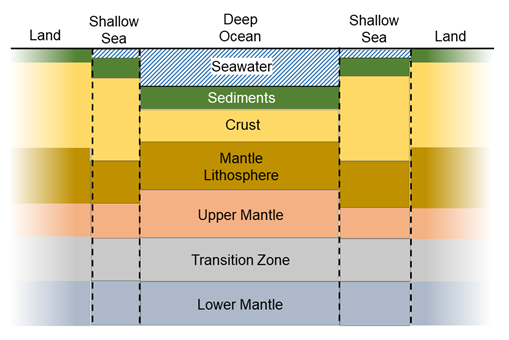
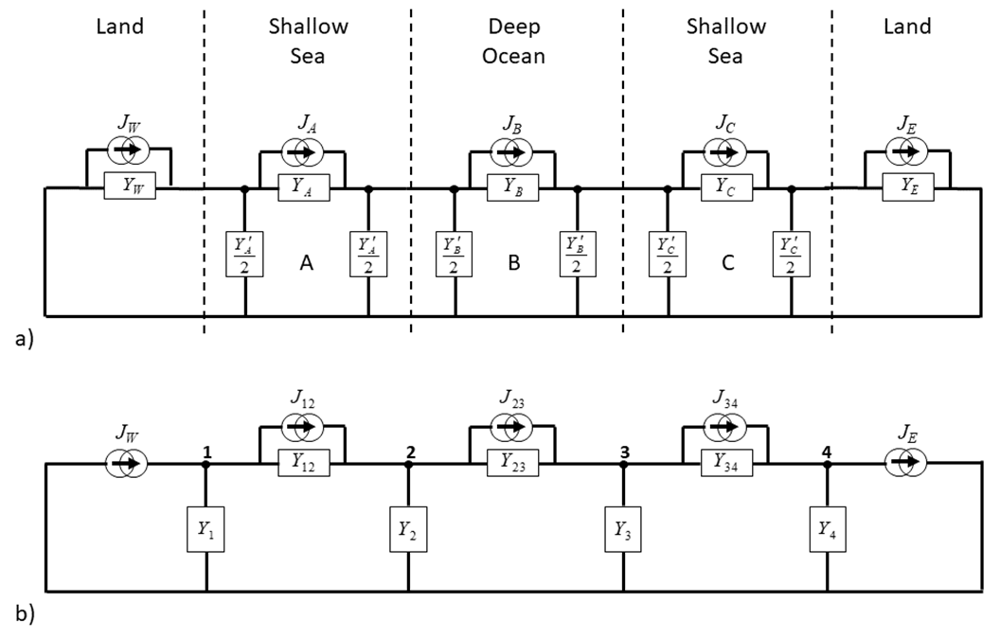

<!-- 
Author(s): Shibaji Chakraborty, Xueling Shi

Disclaimer:
SCUBAS is under the MIT license found in the root directory LICENSE.md 
Everyone is permitted to copy and distribute verbatim copies of this license 
document.

This version of the MIT Public License incorporates the terms
and conditions of MIT General Public License.
-->

The basic structure of the Ocean/Earth conductivity is shown in figure below. The surface layer is comprised of the deep ocean with shallow seas on either side and all these are underlain by a layer of sediments.  On the land on either side of the ocean there will be a surface sedimentary layer that may be very thin or several kilometres thick. Below these are the Earth’s crust, thinner under the oceans than under the land, and the resistive mantle lithosphere.  Deeper in the Earth, in the upper mantle, transition zone and lower mantle the temperature and pressure increase cause partial melting which increases the conductivity. Resistivity values for these layers from the LITHO1.0 model (Chakraborty et al, 2022) and example seawater and layer thicknesses for the different sections are shown in table below. 

|                    | Resistivity    | Layer Thickness (km)                              |
| Layer              | ($\Omega-m$)   | ------------------------------------------------- |
|                    |                | Deep Ocean    | Continental Shelf | Land          |
| ------------------ | -------------- | ------------- | ----------------- | ------------- |
| Seawater           | 0.3            | 4             | 0.1               | 0             |
| Sediments          | 3              | 2             | 3                 | 1             |
| Crust              | 3000           | 10            | 20                | 20            |
| Mantle/Lithosphere | 1000           | 70            | 140               | 140           |
| Upper Mantle       | 100            | 324           | 246.9             | 249           |
| Transition Zone    | 10             | 250           | 250               | 250           |
| Lower Mantle       | 1              | 340           | 340               | 340           |

Geomagnetic induction affects all the sections of the Ocean/Earth conductivity structure shown in abve figure and table. Thus, in the transmission line model of this structure the voltages produced in one section are not just the result of the induced electric fields in that section but are also affected by the induced electric fields in the neighbouring sections. Thus, we need to consider all the transmission line sections together and their influence on each other. This is done by using the equivalent-pi circuits for the ocean and shallow sea sections and Norton equivalent circuits for the land at either end to create a network model of the Ocean/Earth conductivity structure.

The circuit components for the basic Ocean/Earth structure are shown in below figure. This considers an east-west cross-section across an ocean which comprises 3 sections: middle one for the deep ocean and one at each side for the continental shelf. Each section is represented by its equivalent-pi circuit. The land at each end is represented by its Norton equivalent circuit with components $J_W$ and $Y_W$ at the western end, and $J_E$ and $Y_E$ at the eastern end. The admittances to ground from adjacent equivalent-$\pi$ circuits and from the Norton equivalent circuits are combined to give the nodal admittance network as shown in below figure.

To calculate the voltages produced in this transmission line model, the first step is to combine admittances from neighbouring sections in Figure (a) to give the admittance to ground from each node in Figure (b). Nodes 1 and 4 involve the admittance from the Norton equivalent circuit and the admittance from the equivalent-$\pi$ sections for the sea. Finally, to join all the network components the model can be written in matrix form:

$$
\begin{bmatrix}
J_1\\J_2\\J_3\\J_4
\end{bmatrix} = 
\begin{bmatrix}
y_1+y_{12} & -y_{12} & 0 & 0\\
-y_{12} & y_{12}+y_{23}+y_2 & -y_{23} & 0\\
0 & -y_{23} & y_{23}+y_{34}+y_{3} & -y_{34}\\
0 & 0 & -y_{34} & y_{34}+y_4\\
\end{bmatrix}.\begin{bmatrix}
V_1\\V_2\\V_3\\V_4
\end{bmatrix}
$$

The first matrix on the right-hand side of equation is termed the admittance matrix. This, multiplied by the column matrix of nodal voltages equals the column matrix of nodal current source values:

$$
\begin{bmatrix}
V
\end{bmatrix} = 
\begin{bmatrix}
Y
\end{bmatrix}^{-1}.\begin{bmatrix}
J
\end{bmatrix}
$$